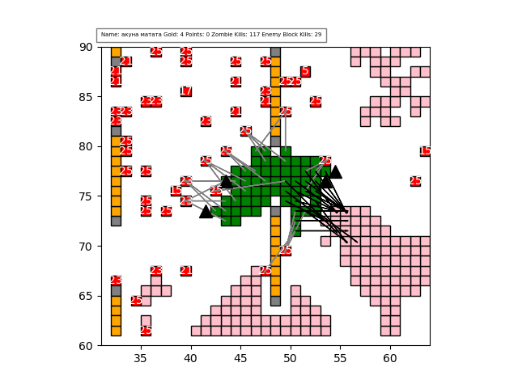
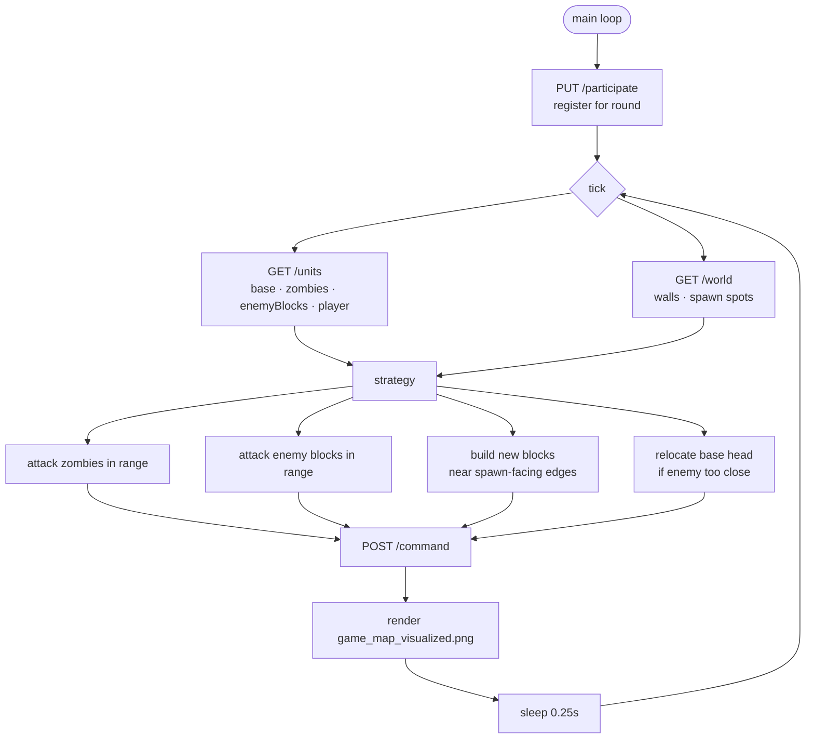

<div align="center">

# 🧟 DatsDefense Strategy Bot

**A real-time autonomous agent for the DatsDefense (`zombidef`) game — polls the game API every tick, shoots zombies, cracks enemy bases, grows and relocates its own base, and renders a live map.**

[](https://www.python.org/)
[](https://requests.readthedocs.io/)
[](https://matplotlib.org/)
[](LICENSE)


[Quick Start](#-quick-start) · [How It Works](#️-how-it-works) · [Strategy](#-strategy) · [Configuration](#️-configuration) · [Docs](#-documentation)

</div>

---

## 🚀 What is this?

**DatsDefense Strategy Bot** is a self-playing client for the DatsDefense (`zombidef`) programming competition run on the [DatsTeam](https://datsteam.dev/) platform. Each round is a tower-defense arena: you own a base made of blocks, waves of zombies march in from spawn spots, and rival teams grow their own bases nearby. The bot connects to the HTTP game API, and on every tick it reads the world state, decides what to attack and where to build, submits its commands, and saves a rendered map of the turn.

It is a single-file hackathon agent (~375 lines in [`main.py`](main.py)) — rough around the edges, but a compact, readable example of driving a real-time game API with a greedy heuristic strategy.

<div align="center">



*Live map rendered each tick: green = your base, red = zombies (with HP), purple/pink = enemy base, gray = walls, orange = spawn spots, arrows = shots, triangles = new builds.*

</div>

## ⚡ Quick Start

```bash
git clone https://github.com/simeonkolchin/datsdefense-strategy-bot.git
cd datsdefense-strategy-bot

python -m venv .venv && source .venv/bin/activate
pip install requests matplotlib

cp .env.example .env          # paste your team token into DATS_TOKEN
export $(grep -v '^#' .env | xargs)   # load env vars (or use direnv / dotenv)

python main.py                # registers for the round and starts playing
```

The bot loops forever: it (re)registers for each round and then polls the game state roughly four times per second until the round ends.

## 🏗️ How It Works



The agent lives in [`main.py`](main.py); the thin HTTP client is [`gameapi.py`](gameapi.py) and the command builder is [`command.py`](command.py).

## 🎯 Strategy

Each tick, `strategy()` builds a fresh [`Command`](command.py) from a set of greedy heuristics:

| Step | Function | Behaviour |
|---|---|---|
| Shoot zombies | `attack_zombies` | Every base block fires at the first live zombie inside its `range`, subtracting its `attack` so it doesn't overkill. |
| Break enemy bases | `attack_enemy_bases` | Same in-range logic applied to rival `enemyBlocks`. |
| Model incoming damage | `handle_zombie_attack` | Predicts which of your blocks each zombie type (normal, fast, bomber, liner, juggernaut, chaos_knight) will hit next tick. |
| Grow the base | `find_build_coords` | Finds free cells adjacent to your blocks, **prioritising those closest to zombie spawn spots**, and builds while gold allows. |
| Relocate the head | `set_move_base` | Moves the base head to one of your blocks that is a safe distance (≥ 6 cells) from enemy blocks. |

Every turn is also dumped to `games/<hour>_<minute>_<n>.json` (unless `DEBUG`), so you can replay rounds offline via `debug_gamestate.py`.

## 🌐 Game API

Base URL: `https://games-test.datsteam.dev/play/zombidef` (override with `DATS_BASE_URL`).

| Method | Endpoint | Purpose |
|---|---|---|
| `PUT` | `/participate` | Register the team for the current round |
| `GET` | `/units` | Current base, zombies, enemy blocks and player stats |
| `GET` | `/world` | Static map: walls and zombie spawn spots (`zpots`) |
| `POST` | `/command` | Submit `attack` / `build` / `moveBase` actions |
| `GET` | `/rounds/zombidef` | Round schedule (used by `check.py`) |

All requests authenticate with the `X-Auth-Token` header.

## ⚙️ Configuration

Configuration is via environment variables (see [`.env.example`](.env.example)).

| Variable | Description |
|---|---|
| `DATS_TOKEN` | Your team's auth token from the DatsTeam registration |
| `DATS_BASE_URL` | Game endpoint (defaults to the `games-test` server) |

Toggle `DEBUG = True` in `main.py` to replay saved rounds from `games/` instead of hitting the live API.

## 📚 Documentation

- [Getting Started](docs/getting-started.md)
- [Architecture](docs/architecture.md)

## 🛡️ Security

Never commit your `DATS_TOKEN`. It lives only in `.env` (gitignored); `.env.example` ships a placeholder. See [SECURITY.md](SECURITY.md).

## 🗺️ Roadmap

- [ ] Path-aware zombie targeting (predict trajectories, focus fire)
- [ ] Smarter build economy (defend chokepoints, not just nearest cell)
- [ ] Configurable strategy parameters via `.env`
- [ ] Replace `time.sleep` polling with adaptive tick timing

## 🧑‍💻 Contributing

Contributions welcome — see [CONTRIBUTING.md](CONTRIBUTING.md).

## 📄 License

MIT © [Simeon Kolchin](https://github.com/simeonkolchin)

> Built during a DatsTeam hackathon. Expect hackathon-grade code — clarity over polish.
