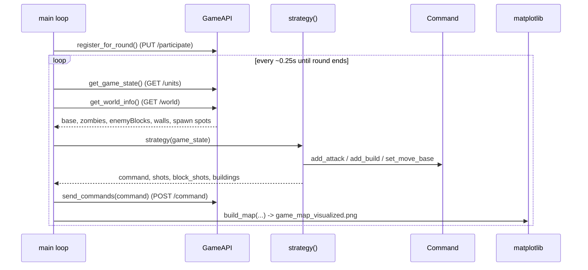

# Architecture

The bot is deliberately small: three Python modules and a game loop.

## Modules

| File | Responsibility |
|---|---|
| `main.py` | Game loop, the `strategy()` heuristics, and matplotlib map rendering. |
| `gameapi.py` | `GameAPI` — a thin `requests` wrapper over the HTTP endpoints, with a `DEBUG` replay mode. |
| `command.py` | `Command` — accumulates `attack` / `build` / `moveBase` actions and serialises them to the API payload shape. |
| `check.py` | Standalone helper that prints the round schedule. |
| `debug_gamestate.py` | A captured `LOCAL_GAME_STATE` sample for offline inspection. |

## The tick loop

## Strategy pipeline

`strategy()` composes independent, greedy steps against a fresh `Command`:

1. **`attack_zombies`** — each base block fires at the first live zombie inside its `range`, decrementing local HP to avoid overkill.
2. **`attack_enemy_bases`** — same range check applied to rival `enemyBlocks`.
3. **`handle_zombie_attack`** — models the cells each zombie type will damage next tick (bombers hit a 3×3, liners hit a cross, etc.) and prunes them from the working base map.
4. **`find_build_coords`** — collects free cells adjacent to your blocks and sorts them by distance to zombie spawn spots (build toward the threat), then builds while gold remains.
5. **`set_move_base`** — relocates the base head to a block that is ≥ 6 cells from any enemy block.

## State and outputs

- **`game_state.json`** — the most recent full state (overwritten each tick).
- **`games/<hour>_<minute>_<n>.json`** — per-turn snapshots for replay.
- **`game_log.txt`** — timestamped event log.
- **`game_map.txt`** — ASCII rendering of the board.
- **`game_map_visualized.png`** — matplotlib rendering (base, zombies with HP, walls, spawn spots, shot arrows, new builds).

## Known rough edges

This is hackathon code. Notably: broad `try/except` blocks around rendering, a duplicated `if not map_data` guard in `build_map`, and a commented-out `filter_zombies_by_direction` experiment left in place. The strategy is purely greedy and has no trajectory prediction — see the roadmap in the README.
